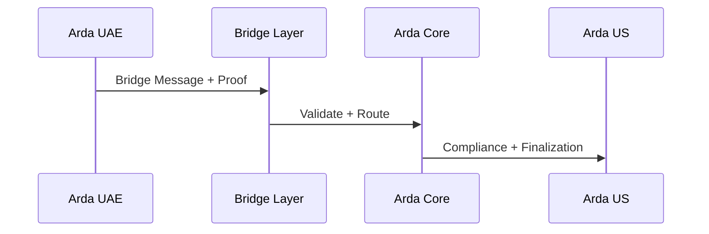

--8<-- "warning.md"
# Bridges

---

## Overview

Bridges are the infrastructure Arda uses to transfer assets, identities, and proofs across chains — both between sovereign ArdaOS regions and to/from external ecosystems like Ethereum, Celestia, or Hyperlane. Bridges preserve compliance guarantees and execution integrity while facilitating liquidity and interoperability.

Each bridge protocol integrates with the Arda Core Interop module and supports programmable compliance enforcement.

---

## Supported Bridge Types

| Bridge | Description |
|--------|-------------|
| Celestia IPC | ZK-enhanced light client-based interop for ArdaOS sovereign chains |
| Hyperlane | General-purpose messaging protocol with modular security models |
| Native Arda Bridge | Specialized channel between ArdaOS chains with KYC-aware flow |
| Oracle Bridge | Institutional validator or attestor-based fallback for lower-speed sync |

---

## Key Properties

| Property | Description |
|----------|-------------|
| Finality Model | BFT, ZK, or multisig-confirmed based on bridge type |
| Compliance Hooks | KYC Tier, JurisdictionProfile, TransferRules applied per instruction |
| Settlement Engine | All bridge actions finalize via Arda Clear |
| Metadata Anchoring | Vault-based hashes ensure token and attestation consistency |
| Retry / Rollback | Fallback logic enabled in Oracle and Native modes |

---

## Message Lifecycle

---

## Use Cases

- Cross-jurisdiction token transfers
- Investor migration across regional liquidity pools
- RFQ clearing with cross-chain participants
- Real estate asset bridging for global investor access

---

## Integration Points

- **Interop Module** — Dispatches and receives bridge messages
- **Vault** — Anchors metadata and bridge contract details
- **Clear** — Executes final asset movements
- **Compliance Engine** — Blocks unauthorized cross-chain events
