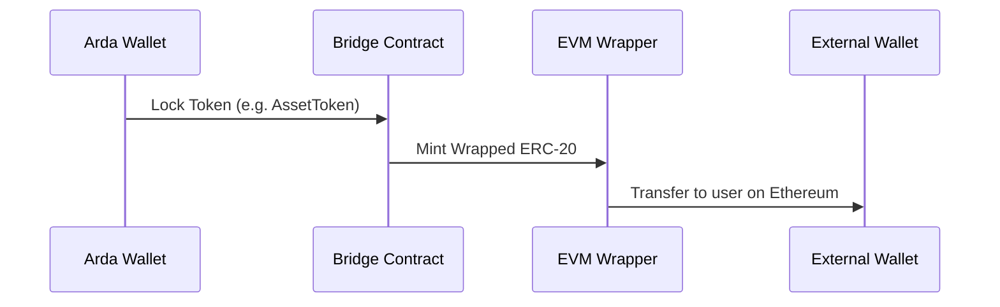

--8<-- "warning.md"
# ERC-20 Wrapping and Token Compatibility

---

## Overview

To ensure composability with the broader DeFi ecosystem, Arda supports wrapping its native token types (e.g. AssetToken, DebtToken, TrancheToken) into ERC-20-compatible formats. This allows tokens issued on ArdaOS chains to be traded, staked, or used in applications on EVM-compatible chains like Ethereum, Arbitrum, or Base.

Wrapping is permissioned and governed by the Compliance Engine to ensure only authorized users can wrap and unwrap tokens for use externally.

---

## Supported Token Types

| Arda Token | Wrapped ERC-20 | Use Case |
|------------|----------------|----------|
| AssetToken | WrappedAssetToken | Secondary trading on Ethereum |
| DebtToken | WrappedDebtToken | Collateral in DeFi or fixed-income products |
| TrancheToken | WrappedTrancheToken | Risk-layered investment vehicles |
| YieldToken | WrappedYieldToken | Streaming yield protocols or vaults |

---

## Wrapping Flow



Unwrapping reverses the flow: tokens are burned on the EVM side and unlocked in Arda.

---

## Compliance Enforcement

- **KYC Tier Check** — Only Tier 2+ users may wrap/unwrap tokens
- **JurisdictionProfile** — Applies export restrictions
- **Wrapped Metadata** — Preserves original token ID, rights, and provenance
- **AuditLog** — Tracks all wrap and unwrap events on-chain

---

## Metadata Mapping

Each wrapped token preserves metadata from its Arda-native counterpart:

```json
{
  "wrappedToken": "WrappedAssetToken",
  "originalTokenId": "AssetToken-004",
  "jurisdiction": "SG",
  "kycTier": 2,
  "rights": ["ownership", "rental_income"]
}
```

---

## Use Cases

- Access to DeFi liquidity for tokenized real estate
- Inclusion in portfolio rebalancing strategies or stablecoin vaults
- FX hedging via synthetic pairs between Arda and external assets
- De-risked lending pools using tokenized, wrapped Arda tranches

---

## Integration

- **Interop / Bridge** — Handles cross-chain locking and minting
- **Clear** — Updates token status and release logs
- **Compliance Engine** — Evaluates wrapping conditions
- **Vault** — Anchors original metadata and token schema
