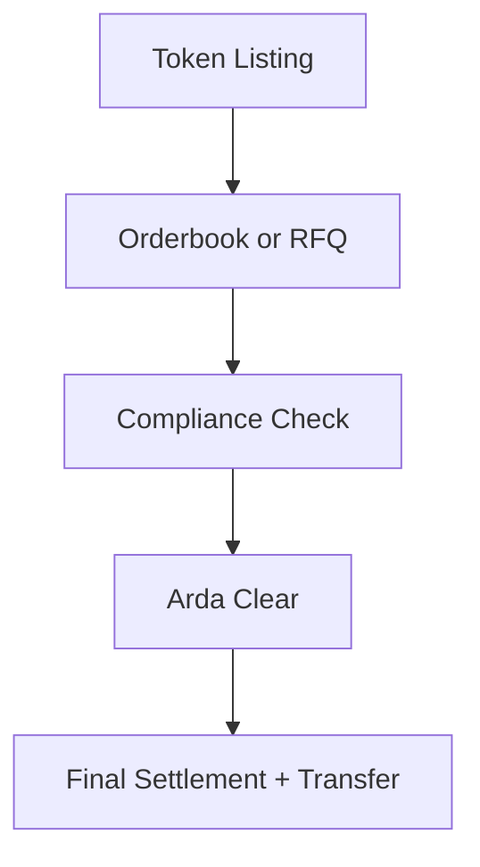

--8<-- "warning.md"

# Arda Trading

---

## Overview

Arda Trading is the secondary market infrastructure layer of the Arda protocol. It supports listing, negotiation, and settlement of tokenized real-world assets and capital instruments, while enforcing full compliance with jurisdictional regulations and KYC-based access control.

Designed for both institutional and retail use cases, Arda Trading offers a hybrid model that combines orderbook-based exchange mechanics with RFQ (Request-for-Quote) workflows to accommodate a wide range of asset types and liquidity profiles.

Arda Trading provides secondary market infrastructure for real-world asset tokens, including fractional property, debt, and structured financial instruments. It supports both public orderbook and private RFQ-based trading, with embedded compliance enforcement and programmable settlement via Arda Clear.

Arda Trading enables institutions, brokers, and individuals to interact with tokenized real estate and private credit as seamlessly as modern equities—while remaining compliant with regional laws and regulations.

---

## Key Capabilities

| Feature | Description |
|---------|-------------|
| Hybrid Orderbook + RFQ | Supports both open matching and bilateral negotiation |
| Compliance-Aware Matching | Pre-trade and post-trade rules integrated at execution |
| Listing Framework | Standardized token listing, metadata, and verification |
| Liquidity Incentives | Programs for brokers, agents, and market makers |
| Arda Clear Integration | All trades settle via the Arda Clear engine for real-time finality |

### 1. **Hybrid Exchange Model**

- Supports both:
  - Public limit and market orders
  - Private negotiated RFQs and OTC trades
- Trade types:
  - AssetToken, DebtToken, TrancheToken, YieldToken

### 2. **Order Management System**

- Standard order types:
  - Limit, market, stop, TWAP, fill-or-kill
- Compliance checks triggered before order execution
- Wallet-level permissions integrated

### 3. **RFQ Engine**

- Brokers and agents can quote or respond to structured deals
- Settlement can be deferred or contingent
- Ideal for large block trades or illiquid asset types

### 4. **Compliance-Layer Matching**

- Matches only allowed trades:
  - Jurisdictional permission
  - Role and wallet status
  - KYC tier and holding limits
- Disallowed trades are rejected before matching

### 5. **Escrow & Conditional Settlement**

- Optional escrow of tokens or payments
- Delayed or phased release
- Useful for milestone-dependent deals or legal finality requirements

---

## Workflow Overview

---

## Supported Asset Types

- AssetTokens (fractional ownership, rent rights)
- DebtTokens (loans, receivables)
- TrancheTokens (securitized pools)
- YieldTokens (cashflow-linked)
- Permissioned Pool Shares

---

## Market Mechanics

- **Public Markets**: Open liquidity and matching, visible to eligible users
- **Private Markets**: Gated trading with attestation-restricted visibility
- **RFQ Mode**: Large blocks or regulated assets negotiated off-book
- **Auction Support**: Optional timed auctions for special or illiquid assets

---

## Integration Points

- **Clear**: All matched trades are routed to Arda Clear for compliance and payment processing
- **Vault**: Metadata and asset documents referenced for verification
- **Compliance Engine**: Filters orders, RFQs, and trade actions
- **Wallet + Identity**: Enforces tier gating and region limits

---

## Use Cases

- Secondary trading of real estate or capital tokens
- Broker-assisted asset sales
- Liquidity exit for crowdfunding participants
- OTC block deals with compliance rails
- Landmark asset auctions with verified buyer pools

---

## Liquidity Features

- **Fractional Ownership**: Enables retail-sized positions
- **Liquidity Incentives**: Market makers and brokers rewarded for tight spreads
- **Asset Pools**: Group similar tokens for index or pooled liquidity
- **Exit Pathways**: For crowdfunded or long-term holders

---

## Settlement

- Executed trades are routed through Arda Clear
- Supports:
  - Instant on-chain swaps
  - Cross-chain or fiat-linked netting
  - Delayed finality for regulated jurisdictions

---

## Developer Notes

- Orderbook and RFQ exposed via SDK and APIs
- Hooks allow post-trade compliance or event triggering
- Governance may whitelist new token types or matching logic via AIP

---

## Example Flow

1. Investor lists 1% of a Dubai property token at market price
2. U.S. buyer submits RFQ for 5% total stake → price and terms agreed
3. Compliance engine verifies eligibility (KYC Tier 3, accredited)
4. Tokens held in escrow until fiat settlement completes
5. Final settlement posted via Arda Clear
