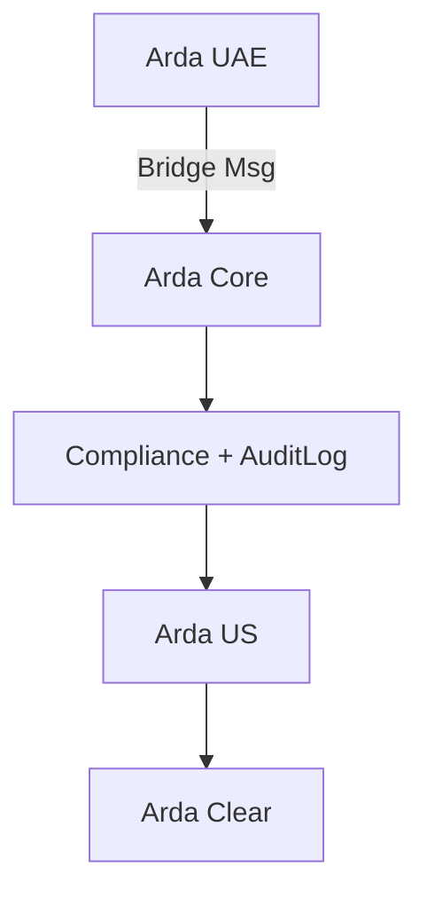

--8<-- "warning.md"

# Cross-Chain Liquidity and Transfers

---

## Overview

Arda Trading supports compliant cross-chain trading of tokenized assets via Interop bridges coordinated with Arda Core. This enables liquidity to move between regional ArdaOS chains and external blockchains (e.g. Ethereum, Celestia) while preserving compliance, identity checks, and finality guarantees.

Bridging is facilitated via verifiable proofs (ZK, MPC, or multisig), and settlement flows through Arda Clear to ensure auditability and legal enforceability.

---

## Use Cases

- Trade an AssetToken issued on Arda UAE on a marketplace in Arda US
- Transfer DebtTokens between chains for collateral aggregation
- Unlock liquidity across regions with shared pool participation
- Enable regulated OTC deals via cross-chain RFQ bridging
- Migrate fractional ownership portfolios between sovereign Arda chains

---

## Supported Bridge Types

| Bridge | Description |
|--------|-------------|
| Celestia IPC | ZK-based sovereign chain interoperability |
| Hyperlane | Modular message relay across chains |
| Native Arda Bridge | Chain-to-chain bridge for KYC-verified transfers |
| Oracle Bridge | Attested fallback via institutional validators (slow-path) |

---

## Compliance Hooks

Every cross-chain instruction checks:

- TransferRule (on sender and recipient chain)
- KYC Tier (both ends)
- JurisdictionProfile
- Vault-based Attestation proofs
- Cross-chain audit sync via AuditLog

---

## Example Bridge Instruction

```json
{
  "txId": "BRIDGE-789",
  "sourceChain": "arda-uae",
  "destinationChain": "arda-us",
  "tokenId": "AssetToken-007",
  "amount": 5,
  "sender": "0xABC",
  "receiver": "0xDEF",
  "status": "PENDING"
}
```

---

## Interop Architecture



---

## Finality + Fallbacks

- Arda Core confirms message receipt
- Destination chain validates sender rules
- Funds/token moved only after full compliance approval
- Timeout + rollback available on Oracle fallback bridges
