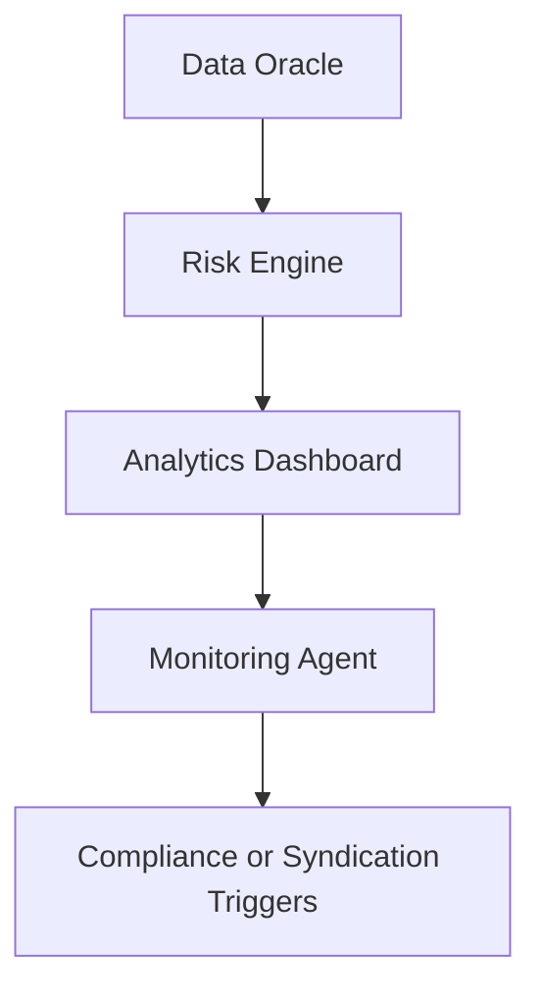

# Analytics & Reporting

---

## 🧭 Overview

The Analytics module in Arda Capital provides real-time, on-chain and off-chain performance insights for loans, pools, tranches, and portfolios. It leverages protocol-native data structures, observability agents, and risk primitives to power dashboards, reports, and agent-based triggers.

Analytics is critical for investors, syndicate managers, regulators, and governance actors to track capital health, risk exposure, and compliance adherence.

---

## Core Features

| Feature | Description |
|---------|-------------|
| FacilityRegistry | Canonical index of all active and historical loan structures |
| TrancheIndex | Aggregated tranche-level performance and exposure metrics |
| RiskPrimitives | Shared metrics such as PD, LGD, LTV, volatility, Sharpe ratio |
| DataOracles | External feeds (market rates, FX, index values, price benchmarks) |
| Monitoring Agents | Automated event detection (defaults, covenants, delays) |

---

## Example Metrics

- **Current LTV per loan or pool**
- **Tranche occupancy rate**
- **Interest paid vs scheduled**
- **Net capital outstanding**
- **Sharpe ratio of a tranche pool**
- **Exposure by region, property type, or risk class**
- **Defaults or missed payments (flagged by agent)**

---

## Example: Monitoring Agent Output

```json
{
  "loanId": "LN-1102",
  "status": "risk_alert",
  "trigger": "missed_interest_payment",
  "timestamp": "2025-06-15T00:00:00Z",
  "details": {
    "expected": 50000,
    "received": 0,
    "daysOverdue": 10
  }
}
```

---

## System Architecture



---

## Integration

- **FacilityRegistry**: Indexes and categorizes active capital deals
- **Vault**: Provides attested off-chain data inputs for metrics
- **Identity Module**: Attributes roles and risk to entities and wallets
- **Interop Layer**: Aggregates data from multiple sovereign regions

---

## Related Docs

- [`underwriting.md`](./underwriting.md)
- [`syndication.md`](./syndication.md)
- [`compliance.md`](./compliance.md)
- [`vault.md`](../arda-core/vault.md)

---

*© Arda OS Documentation • Licensed under MIT*
