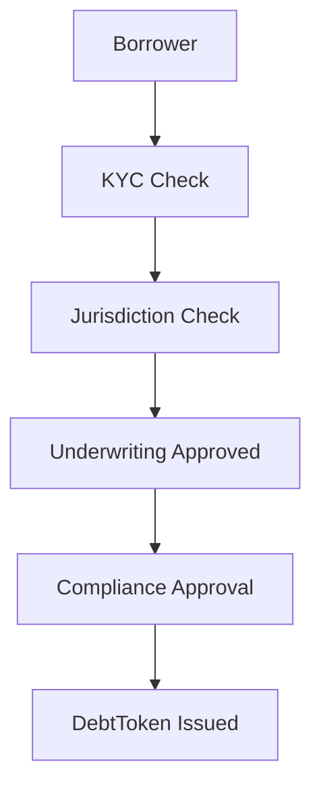

# Compliance

---

## 🧭 Overview

This document defines how Arda Capital applies compliance enforcement across the lending, syndication, and tokenization lifecycle. While Arda Core's Compliance Engine provides the base enforcement primitives, Arda Capital extends them to enforce eligibility, permissioning, and transparency in capital markets contexts.

Compliance is embedded directly in the capital workflow—from loan issuance and investor onboarding to capital deployment, repayment, and redemption.

---

## Enforcement Domains

| Domain | Enforcement Logic |
|--------|-------------------|
| Loan Origination | Verifies borrower identity, jurisdiction, and eligibility using KYC Tier + Attestation |
| Syndication Pools | Restricts participation based on KYC Tier, region, investor class |
| Tranches | Transfers governed by TransferRules and Token restrictions |
| Interest/Fee Split | Verifies destination wallet and authorized roles for distributions |
| Pool Creation | Pool creators must pass verification and declare jurisdictional config |

---

## Compliance Objects Used

- **TransferRule** — Enforces who can send/receive capital-related tokens
- **JurisdictionProfile** — Applies limits or bans based on regional policy
- **AttestationRegistry** — Validates KYC status, accreditation, and role-based access
- **AuditLog** — Immutable record of capital events (e.g. pool entry, loan payment, distribution)

---

## Sample Loan Compliance Flow



If any step fails, the transaction is rejected at the protocol layer and logged.

---

## Example Tranche TransferRule

```json
{
  "tokenType": "TrancheToken",
  "fromKycTier": 2,
  "toKycTier": 2,
  "jurisdiction": "US",
  "restrictions": {
    "accredited_only": true,
    "maxAUM": 10000000
  }
}
```

This ensures only accredited US investors can transfer or receive this tranche, and no single holder exceeds AUM limits.

---

## Integration Points

- **Token Factory**: Ensures tokens are linked to compliant Issuers and Mandates
- **Vault**: Anchors legal agreements and compliance attestations
- **Identity Module**: Determines role permissions and wallet group bindings
- **Syndication + Pools**: Apply eligibility criteria before allocation

---

## Related Docs

- [`token-factory.md`](../arda-core/token-factory.md)
- [`identity.md`](../arda-core/identity.md)
- [`permissioned-pools.md`](./permissioned-pools.md)
- [`syndication.md`](./syndication.md)

---

*© Arda OS Documentation • Licensed under MIT*
