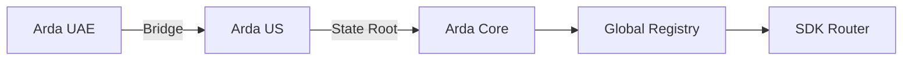

# Arda Interop

> *Version: 1.0 • Last updated: 2025-06-23*

---

## Overview

Arda Interop is the cross-region and cross-chain interoperability layer for the Arda ecosystem. It allows assets, identities, and transaction intents to flow between sovereign ArdaOS chains while preserving compliance, consistency, and settlement guarantees.

Interop ensures that regional chains can operate autonomously without fragmenting liquidity, identity verification, or compliance standards.

---

## Core Components

| Component | Description |
|-----------|-------------|
| `Bridge Gateway` | Secure message-passing between ArdaOS regions and/or external chains |
| `Global Asset Registry` | Maps token IDs and asset metadata across regions for consistency |
| `SDK Router` | Abstracts away destination region and handles endpoint resolution |
| `xCall API` | Unified interface for initiating cross-region function calls |
| `Proof Sync Engine` | Verifies foreign state roots or bridge attestations (ZK, MPC, or multisig) |

---

## Cross-Region Use Cases

- **Asset Migration**: Move an `AssetToken` from Arda UAE to Arda US while maintaining KYC and rights.
- **Investor Access**: Let a verified investor from one jurisdiction access deals in another (if permitted).
- **Syndication Pooling**: Aggregate commitments from multiple regions into a shared capital pool.
- **Global Order Routing**: Trade tokens issued in one region via marketplaces in another.
- **Audit & Compliance Sync**: Share transaction logs and attestations across regions.

---

## Architecture

Each ArdaOS chain maintains its own consensus but interoperates via authenticated message-passing and SDK-coordinated function calls.

---

## Bridge Types Supported

| Type | Description |
|------|-------------|
| Celestia IPC | Light client-based with ZK enhancements |
| Hyperlane | Modular security + fast message relaying |
| Native Bridge | Chain-specific bridge contracts with attestation validation |
| Off-chain Oracle | For fallback use, centralized attestor with time delay |

---

## Security & Finality

All interop operations require:

- **Origin Chain Finality** — Confirmed state on sender chain (e.g. block inclusion + finalization).
- **Verification** — Proof-of-state or proof-of-event matched by receiver chain.
- **Compliance Re-evaluation** — Receiving chain enforces local rules before accepting execution.
- **Fallbacks** — Timeouts, dispute periods, and circuit breakers to prevent fraud or mismatch.

---

## Related Docs

- [`naas.md`](./naas.md)
- [`clear.md`](./clear.md)
- [`compliance.md`](./compliance.md)
- [`README.md`](./README.md)

---

*© Arda OS Documentation • Licensed under MIT*
