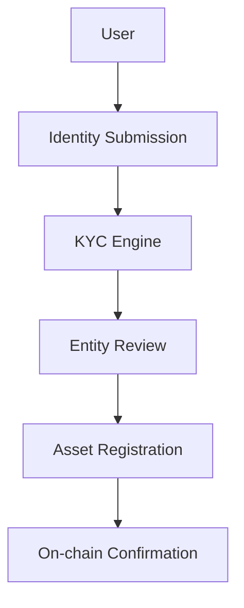

# Arda Onboarding

> *Version: 1.0 • Last updated: 2025-06-23*

---

## Overview

Arda Onboarding is the module responsible for registering new users, entities, and real-world assets into the Arda ecosystem. It ensures that all participants meet jurisdictional compliance standards and that off-chain real estate assets are accurately and verifiably linked to their on-chain representations.

This module supports integration with land registries, legal verification providers, and identity attestations, offering both API-based and manual fallback workflows for onboarding in digitized and non-digitized jurisdictions.

---

## Core Functions

- **User Onboarding**: Guides individuals and institutions through KYC/AML checks, assigning identity and wallet permissions.
- **Entity Creation**: Registers legal entities (SPVs, trusts, funds) and binds wallet groups and roles to them.
- **Asset Registration**: Links tokenized properties or rights to verified ownership documents and metadata.
- **Jurisdiction-Specific Flows**: Adapts onboarding workflows based on local regulatory requirements.
- **Fallback Verification**: Enables manual onboarding through notaries, certified providers, or legal agents.

---

## Workflow Overview

---

## Integration Points

- **Land Registry APIs**: Automated property record validation (where available).
- **Legal Notary Gateways**: Certified document and signature verification.
- **Compliance Engine**: Syncs KYC tier and jurisdictional logic upon onboarding.
- **Vault**: Secure storage of documents and audit trails linked to onboarding events.

---

## Roles Involved

| Role | Description |
|------|-------------|
| Applicant | User or organization initiating onboarding |
| Verifier | Compliance service validating identity or asset |
| Notary | Trusted manual fallback verifier |
| Registrar | Smart contract issuing asset token and metadata |
| Auditor | Monitors and logs onboarding events for compliance review |

---

## Compliance Considerations

- **Dynamic Jurisdiction Flow**: Forms, checks, and disclosures vary per region.
- **Attestation Registry**: All verifications are immutably logged for later proof.
- **Revocation Support**: Identity or asset claims can be revoked and re-onboarded if disputed or stale.

---

## Related Docs

- [`vault.md`](./vault.md)
- [`compliance.md`](./compliance.md)
- [`identity.md`](./identity.md)
- [`token-factory.md`](./token-factory.md)

---

*© Arda OS Documentation • Licensed under MIT*
