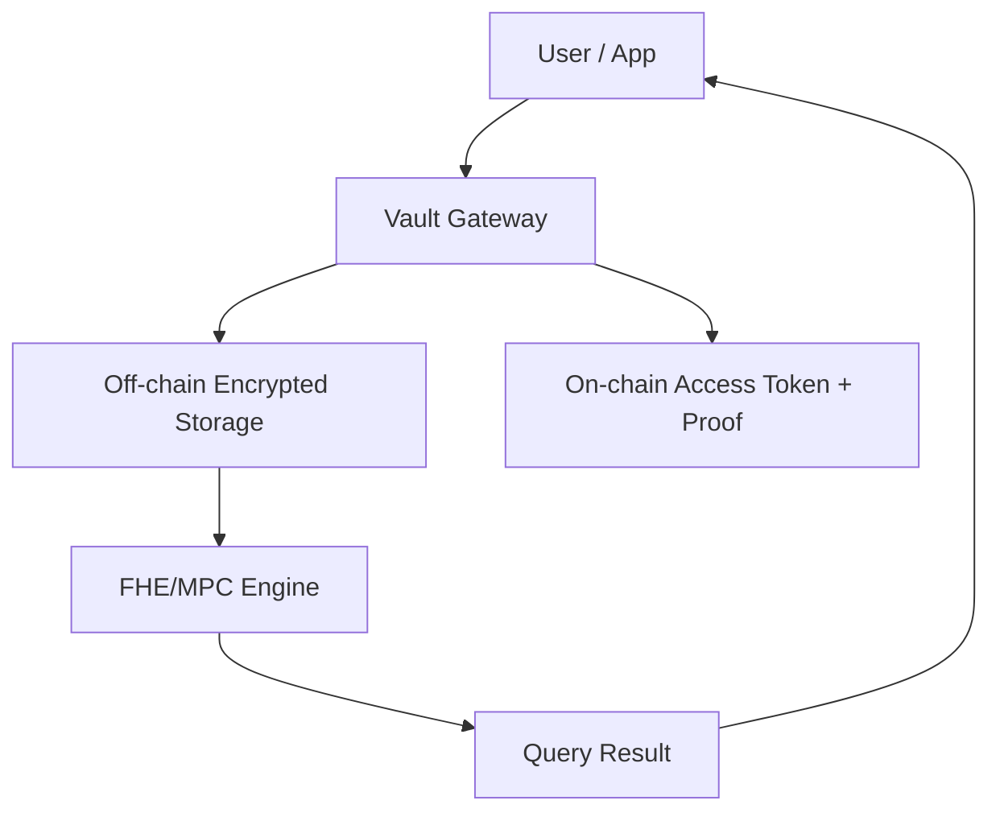

--8<-- "warning.md"
# Arda Vault

---

## Overview

Arda Vault is the privacy-preserving data layer of the Arda protocol. It enables secure storage and controlled access to sensitive real estate, financial, and identity-related information. The Vault combines on-chain anchoring with off-chain encrypted storage, supporting real-time compliance and due diligence while maintaining strict privacy guarantees.

It is a critical component of Arda Core, enabling institutional-grade security, selective disclosure, and cryptographic verifiability for all asset and entity records.

---

## Key Features

- **Fully Homomorphic Encryption (FHE)**: Enables computation on encrypted data (e.g., verifying LTV or ownership thresholds).
- **Multi-Party Computation (MPC)**: Allows secure query execution without exposing raw data.
- **Hybrid Storage Model**: Off-chain encrypted documents with on-chain integrity proofs.
- **Permissioned Access**: Granular access control for verifiers, inspectors, investors, and regulators.
- **Rich Media Support**: Supports structured documents, images, 3D plans, videos, and inspection metadata.

---

## Supported Data Types

| Category | Examples |
|----------|----------|
| Title & Ownership | Deeds, land registry entries, SPV documents |
| Financial | Appraisals, rent rolls, audit reports, drawdown schedules |
| Legal | Trust documents, regulatory filings, tax forms |
| Operational | Maintenance logs, inspection footage, building plans |
| Identity | KYC data, attestation proofs, account-level metadata |

---

## Access & Query Model

Arda Vault does not expose raw data by default. All access is governed through permissioned keys and audit trails:

- **Verifiable Computation**: Queries can be answered with cryptographic proofs (e.g. "is owner verified" or "does valuation exceed threshold") without revealing sensitive inputs.
- **Dynamic Access Controls**: Permissions can be granted/revoked at runtime based on user roles or compliance context.
- **Audit Logs**: Every access event is immutably recorded on-chain for regulatory traceability.

---

## Architecture

---

## Compliance Use Cases

- **Proof of Asset**: FHE-based attestation that tokenized assets reflect valid off-chain ownership.
- **Cross-border Compliance**: Enables selective disclosure for regulators in different jurisdictions.
- **Regulated Identity Workflows**: Used by KYC/AML engines to securely access identity proofs.
