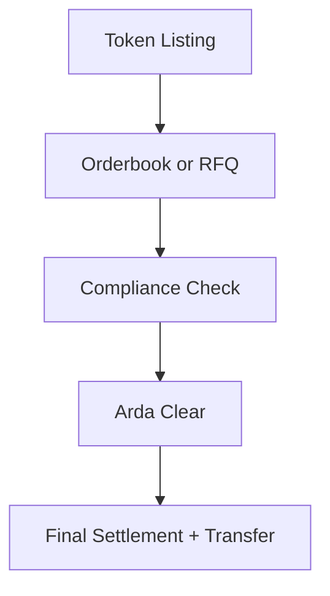

# Arda Trading

> *Version: 1.0 • Last updated: 2025-06-23*

---

## Overview

Arda Trading is the secondary market infrastructure layer of the Arda protocol. It supports listing, negotiation, and settlement of tokenized real-world assets and capital instruments, while enforcing full compliance with jurisdictional regulations and KYC-based access control.

Designed for both institutional and retail use cases, Arda Trading offers a hybrid model that combines orderbook-based exchange mechanics with RFQ (Request-for-Quote) workflows to accommodate a wide range of asset types and liquidity profiles.

---

## Key Capabilities

| Feature | Description |
|---------|-------------|
| Hybrid Orderbook + RFQ | Supports both open matching and bilateral negotiation |
| Compliance-Aware Matching | Pre-trade and post-trade rules integrated at execution |
| Listing Framework | Standardized token listing, metadata, and verification |
| Liquidity Incentives | Programs for brokers, agents, and market makers |
| Arda Clear Integration | All trades settle via the Arda Clear engine for real-time finality |

---

## Workflow Overview

---

## Supported Asset Types

- AssetTokens (fractional ownership, rent rights)
- DebtTokens (loans, receivables)
- TrancheTokens (securitized pools)
- YieldTokens (cashflow-linked)
- Permissioned Pool Shares

---

## Market Mechanics

- **Public Markets**: Open liquidity and matching, visible to eligible users
- **Private Markets**: Gated trading with attestation-restricted visibility
- **RFQ Mode**: Large blocks or regulated assets negotiated off-book
- **Auction Support**: Optional timed auctions for special or illiquid assets

---

## Integration Points

- **Clear**: All matched trades are routed to Arda Clear for compliance and payment processing
- **Vault**: Metadata and asset documents referenced for verification
- **Compliance Engine**: Filters orders, RFQs, and trade actions
- **Wallet + Identity**: Enforces tier gating and region limits

---

## Use Cases

- Secondary trading of real estate or capital tokens
- Broker-assisted asset sales
- Liquidity exit for crowdfunding participants
- OTC block deals with compliance rails
- Landmark asset auctions with verified buyer pools

---

## Related Docs

- [`orderbook.md`](./orderbook.md)
- [`fractional.md`](./fractional.md)
- [`settlement.md`](./settlement.md)
- [`compliance.md`](./compliance.md)

---

*© Arda OS Documentation • Licensed under MIT*
