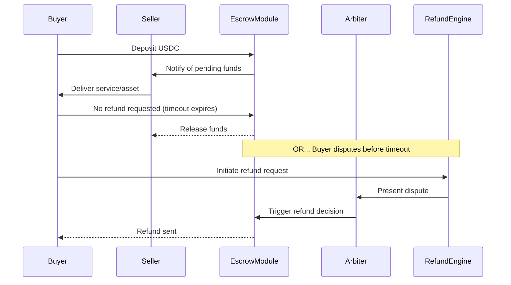

# Arda: Refund Protocol Integration Architecture

## Objective

Integrate a non-custodial, programmable refund mechanism for stablecoin payments within the Arda ecosystem to increase transaction trust, support high-value cross-border deals, and enable dispute resolution without centralization.

---

## Core Design Principles

- **Non-Custodial by Default**: All funds remain under protocol-controlled state with deterministic execution logic.
- **Composable Arbitration**: Dispute resolution integrates third-party or platform-curated arbiters with no unilateral power over funds.
- **Trust-Minimized UX**: Designed for retail and institutional users to reduce counterparty risk and increase real estate transaction confidence.

---

## Architecture Components

### 1. **Protocol-Embedded Escrow Module**

- Holds stablecoin (e.g., USDC) in protocol-controlled escrow state until:
  - Timelock expires
  - Both parties sign a release
  - Arbiter triggers a refund
- Emits events for off-chain indexing (e.g., "RefundInitiated", "FundsReleased")

### 2. **Arbiter Registry Module**

- Maintains a whitelisted registry of arbiters
- Encodes rules:
  - Max decision timeframe
  - Resolution thresholds
  - Auditable dispute logs

### 3. **Refund Resolution Engine (off-chain service)**

- Runs workflows:
  - Off-chain consent handling
  - Dispute evidence submission
  - Notifies arbiter + tracks timeouts
- May leverage zk-verified attestations for decision logs

### 4. **Wallet Abstraction Layer**

- Supports EIP-1271 for contract/custodial wallets
- Optional signature relaying for Web2-style UX

### 5. **Yield Vault Adapter (optional)**

- Temporarily deposits escrowed stablecoins into yield-bearing protocols
- Funds remain withdrawable on resolution
- Shared yield model (Arda, Arbiter, or end-user split)

---

## Refund Flow Overview

---

## Compliance & Auditability

- **Immutable logs**: All actions (submit, respond, resolve) emitted by the protocol
- **Configurable jurisdictional rules**: Protocol enforces region-specific arbitration laws if needed
- **Audit trail**: zk-attestation or IPFS-linked evidence optional

---

## Developer SDK Hooks

- `createEscrow(entityId, amount, arbiterId)`
- `initiateRefund(escrowId, evidenceRef)`
- `releaseFunds(escrowId)`
- `resolveDispute(escrowId, resolution)`

---

## Monetization Hooks

- Arbitration fees (flat or percent-based)
- Early withdrawal premium
- Yield capture on locked funds
- API subscription for RefundEngine access
